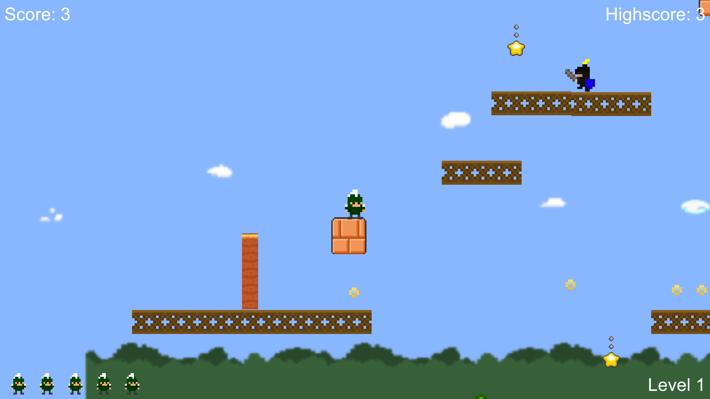

<!DOCTYPE html>
<html>
  <head>
    <meta content="text/html; charset=UTF-8" http-equiv="content-type">
   
</head>
  <body>
    <h1>Super Sparty Bros.</h1>
    
Created by Shai

    
    <ul class="menu">
      <li> 
      </li>
      <li><a href="WebGL/index.html" class="menuButton">Play Online  
          (WebGL browser support required)</a></li>
      <li><a href="Mac.zip" class="menuButton">Download Mac Version</a></li>
      <li><a href="Windows.zip" class="menuButton">Download Windows Version</a></li>
      <!--
      <li><a  href="http://itunes.com/apps/APPNAME" class="menuButton">Download iOS Version</a></li>      <li><a  href="https://play.google.com/store/apps/details?id=APPBUNDLEID" class="menuButton">Download Android Version</a></li>
      -->
    </ul>
    

      
Game Description:

      
Collect coins, avoid enemies, and go for the rose!

    

     
    

      
Game Modifications:

      <ol>
      </ol>
      -New platform
-New coin type (bonus)
-Added walls
-New background objects
-More enemies
-Added 2nd level
      <ol>
      </ol>
    

    
© Michigan State University. All Rights Reserved. 

  </body>
</html>
